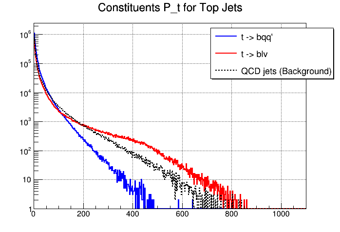

# Histograms_JC_interaction

This repository provides tools for the analysis and visualization of histogram data focusing on joint and conditional interactions in particle physics. The repository features plots derived from simulated ATLAS detector data, showcasing various particle interactions, including W, Z, Higgs bosons, and top quarks.

---

## Table of Contents
1. [Introduction](#introduction)
2. [Prerequisites](#prerequisites)
3. [Building and Running](#building-and-running)
4. [Visualizations](#visualizations)
5. [Contributing](#contributing)
6. [License](#license)

---

## Introduction

This repository contains scripts and tools designed to analyze particle physics data. The visualizations produced by these scripts can be used to study:
- Jet substructure variables (\( \tau_n / \tau_{n-1} \))
- Jet mass distributions
- Transverse momentum (\( p_T \)) distributions for jet constituents

---

## Prerequisites

- **C++ Compiler** (e.g., GCC or Clang)
- **ROOT Framework**: Used for statistical data analysis and visualization
- **CMake**: For building the project

---

## Building and Running

1. **Clone the repository**:
   git clone https://github.com/lufdema/Histograms_JC_interaction.git

2. **Navigate to the directory**:
   cd Histograms_JC_interaction

3. **Build the project**:
   mkdir build && cd build
   cmake ..
   make

4. **Run examples**:
   Execute scripts provided in the `examplesLP` directory to generate histograms and analyze data.

---

## Visualizations

The following are example plots generated using the tools in this repository:

### Jet Substructure for W and Z Jets

### Jet Substructure for Top Jets

### Jet Substructure for Higgs Jets

### Constituent \( p_T \) for W and Z Jets

### Constituent \( p_T \) for Top Jets

### Constituent \( p_T \) for Higgs Jets

### Jet Mass Distribution for W and Z Jets

### Jet Mass Distribution for Top Jets

### Jet Mass Distribution for Higgs Jets

---

## Contributing

Contributions are welcome! Please fork the repository and submit a pull request.

---

## License

This project is licensed under the MIT License. See the LICENSE file for details.

---
